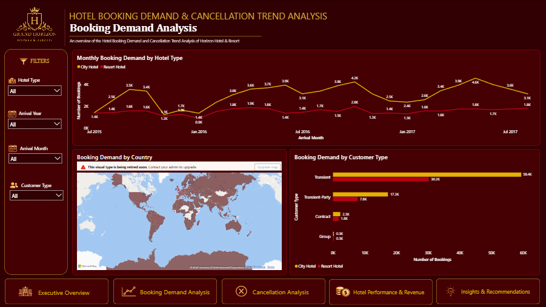
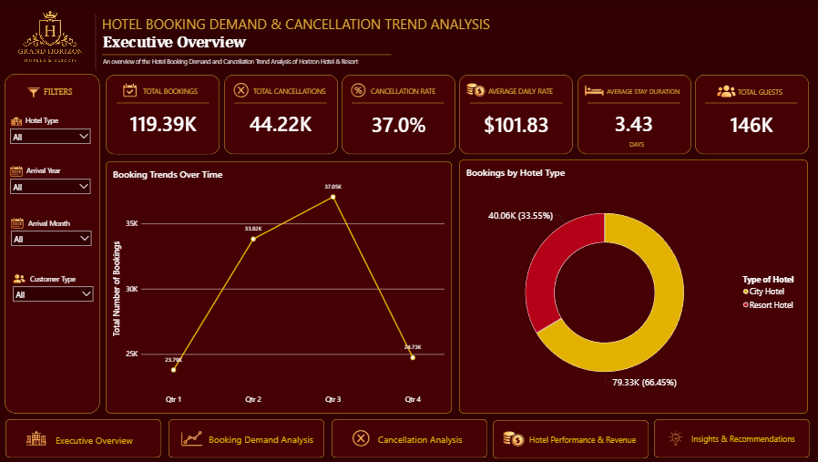
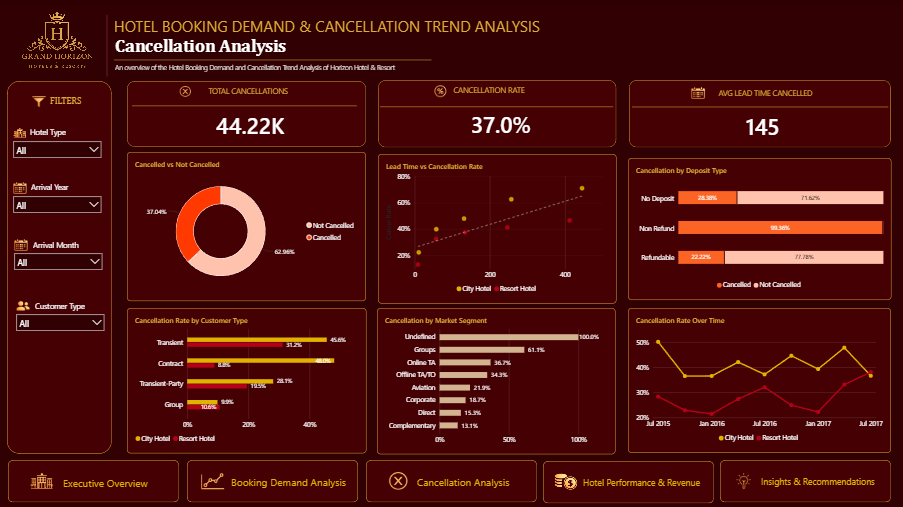
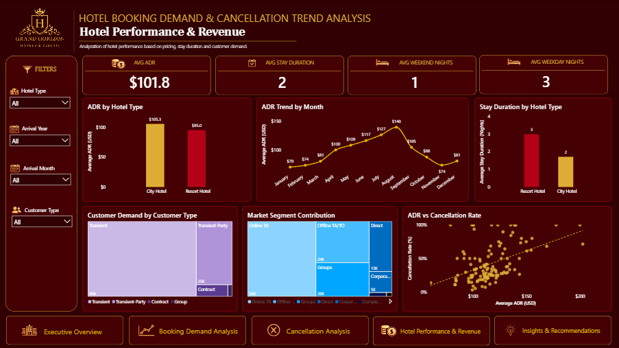
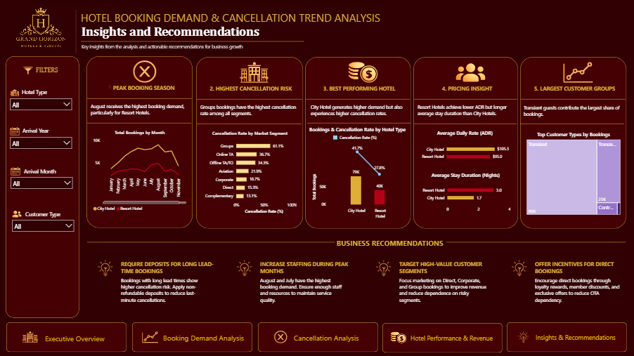

# 🏨 Hotel Booking Demand & Cancellation Trend Analysis

An interactive **Power BI dashboard** developed to analyze hotel booking demand, cancellation patterns, hotel performance, customer behavior, and revenue-related trends.

This project uses hotel booking data to transform raw booking information into meaningful visual insights that can support **data-driven decision making in the hospitality industry**.

---

## 📌 Project Overview

Hotel booking data contains valuable information about customer reservations, cancellations, hotel types, booking patterns, market segments, and pricing.

This project analyzes these patterns using **Microsoft Power BI** and presents the results through an interactive dashboard.

The dashboard focuses on:

* Booking demand and seasonal trends
* Cancellation behavior
* Hotel performance
* Revenue and pricing indicators
* Customer types
* Market segments
* Business insights and recommendations

---

## 🎯 Objectives

The objectives of this project are to:

1. Analyze hotel booking demand and trends over time.
2. Examine cancellation patterns and identify factors associated with cancellations.
3. Compare the performance of City Hotel and Resort Hotel.
4. Analyze customer types and market segments.
5. Examine pricing and stay-duration patterns.
6. Provide actionable insights and recommendations based on the analysis.

---

## 🛠️ Tools Used

| Tool                      | Purpose                                             |
| ------------------------- | --------------------------------------------------- |
| **Microsoft Power BI**    | Data analysis, visualization, dashboard development |
| **Power BI Desktop**      | Report and `.pbix` file development                 |
| **Hotel Booking Dataset** | Data source for the analysis                        |

---

## 📊 Dashboard Overview

The Power BI dashboard consists of **five main analytical sections**:

1. Executive Overview
2. Booking Demand Analysis
3. Cancellation Analysis
4. Hotel Performance & Revenue
5. Insights & Recommendations

---

# 1. 📅 Booking Demand Analysis

The Booking Demand Analysis page examines how booking demand changes across time, hotel types, countries, and customer categories.

### Analysis Includes

* Booking demand over time
* Booking demand by hotel type
* Booking demand by country
* Booking demand by customer type

### Key Insights

* **City Hotel** contributes a larger proportion of total bookings compared with Resort Hotel.
* **Transient customers** represent the largest customer group.
* Booking demand varies across different months, indicating seasonal patterns.
* Understanding demand patterns can help hotels plan their operations and resources more effectively.



---

# 2. 📈 Executive Overview

The Executive Overview provides a summary of the overall hotel booking performance.

### Key Metrics

* **Total Bookings:** 119.39K
* **Total Cancellations:** 44.22K
* **Cancellation Rate:** 37.0%
* **Average Daily Rate (ADR):** $101.83
* **Average Stay Duration:** 3.43 days
* **Total Guests:** 146K

### Analysis

This page provides an overall view of booking activity and allows comparison between **City Hotel** and **Resort Hotel**.

It also presents booking trends over time and provides an overview of the overall cancellation situation.



---

# 3. ❌ Cancellation Analysis

The Cancellation Analysis page focuses on understanding booking cancellations and identifying patterns associated with cancellation behavior.

### Key Metrics

* **Total Cancellations:** 44.22K
* **Cancellation Rate:** 37.0%
* **Average Lead Time of Cancelled Bookings:** 145 days

### Analysis Includes

* Cancelled vs. non-cancelled bookings
* Cancellation rate by customer type
* Cancellation rate by market segment
* Cancellation rate by deposit type
* Cancellation trends
* Lead time and cancellation behavior

### Key Insights

A significant proportion of hotel bookings are cancelled, with an overall cancellation rate of approximately **37%**.

The analysis also shows differences in cancellation behavior across customer types, market segments, deposit types, and booking lead times.

These patterns can help hotel management identify areas where cancellation policies and booking strategies may need improvement.



---

# 4. 💰 Hotel Performance & Revenue

The Hotel Performance & Revenue page evaluates hotel performance using pricing, stay duration, booking demand, and market segment information.

### Key Metrics

* **Average Daily Rate (ADR):** $101.83
* **Average Stay Duration:** 2 days
* **Average Weekend Nights:** 1 night
* **Average Weekday Nights:** 3 nights

### Analysis Includes

* ADR by hotel type
* Monthly ADR trends
* Stay duration by hotel type
* Customer demand
* Market segment contribution
* ADR and cancellation patterns

### Key Insights

* City Hotel records a higher ADR compared with Resort Hotel.
* Resort Hotel shows different stay-duration patterns compared with City Hotel.
* ADR changes across different months, indicating seasonal pricing patterns.
* Monitoring both pricing and cancellation behavior can help improve revenue management decisions.



---

# 5. 💡 Insights & Recommendations

The final dashboard section summarizes the major findings from the analysis and translates them into potential business actions.

## Key Insights

### 📌 Seasonal Demand

Booking demand varies throughout the year, with certain months showing higher booking activity.

### 📌 Cancellation Risk

The overall cancellation rate is substantial, making cancellation management an important area for hotel operations.

### 📌 Customer Demand

Transient customers represent the largest customer group and contribute significantly to overall booking demand.

### 📌 Hotel Performance

City Hotel generates a larger share of bookings and records a higher ADR compared with Resort Hotel.

### 📌 Market Segments

Different market segments demonstrate different booking and cancellation behaviors, providing opportunities for more targeted strategies.

---

## 💼 Recommendations

### 1. Improve Cancellation Management

Hotels can review cancellation policies and consider suitable deposit or booking conditions for reservations with higher cancellation risk.

### 2. Plan Resources According to Demand

Staffing and operational resources can be adjusted according to periods of high and low booking demand.

### 3. Optimize Pricing Strategies

Hotels can monitor seasonal ADR patterns and adjust pricing strategies according to changes in demand.

### 4. Target Valuable Customer Segments

Marketing strategies can be tailored toward customer groups and market segments that contribute significantly to bookings and revenue.

### 5. Encourage Direct Bookings

Hotels can develop incentives for direct bookings to strengthen customer relationships and potentially reduce reliance on third-party booking channels.



---

# 📊 Key Findings at a Glance

| Metric                |        Result |
| --------------------- | ------------: |
| Total Bookings        |   **119.39K** |
| Total Cancellations   |    **44.22K** |
| Cancellation Rate     |     **37.0%** |
| Average Daily Rate    |   **$101.83** |
| Average Stay Duration | **3.43 days** |
| Total Guests          |      **146K** |

---

# 🔍 Business Questions

This dashboard helps answer the following questions:

* What is the overall hotel booking demand?
* Which hotel receives more bookings?
* How does booking demand change over time?
* What is the overall cancellation rate?
* Which customer groups have different cancellation patterns?
* Which market segments contribute to booking demand?
* How does ADR vary between City Hotel and Resort Hotel?
* How does stay duration differ between hotel types?
* What patterns can be identified from booking and cancellation data?
* What strategies can hotels use to improve their performance?

---

# 📂 Project Structure

```text
Hotel-Booking-Demand-Cancellation-Analysis/
│
├── README.md
│
├── Group 1 Hotel Booking Demand.pbix
│
└── dashboard/
    ├── executive-overview.png
    ├── booking-demand-analysis.png
    ├── cancellation-analysis.png
    ├── hotel-performance-revenue.png
    └── insights-recommendations.png
```

---

# 🖥️ Power BI Report

The main Power BI report file is:

**`Group 1 Hotel Booking Demand.pbix`**

The `.pbix` file contains the Power BI report and dashboard developed for this project.

> **Note:** The original dataset is not included in this repository. The dashboard was developed using a hotel booking dataset as the data source.

---

# 🖼️ Dashboard Preview

## Booking Demand Analysis


## Executive Overview


## Cancellation Analysis


## Hotel Performance & Revenue


## Insights & Recommendations


---

# 📌 Conclusion

The **Hotel Booking Demand & Cancellation Trend Analysis** dashboard provides an interactive overview of hotel booking behavior, cancellation patterns, customer demand, pricing, and hotel performance.

Using **Microsoft Power BI**, the project transforms hotel booking data into visual insights that can help identify demand trends, cancellation risks, customer patterns, and performance differences between hotel types.

The findings can support hotel management in making more informed decisions related to **demand planning, cancellation management, pricing, resource allocation, and customer targeting**.

---

## 👩‍💻 Project Information

**Project Title:** Hotel Booking Demand & Cancellation Trend Analysis

**Power BI File:** `Group 1 Hotel Booking Demand.pbix`

**Tool:** Microsoft Power BI

**Project Focus:** Hotel Booking Analytics & Business Intelligence
